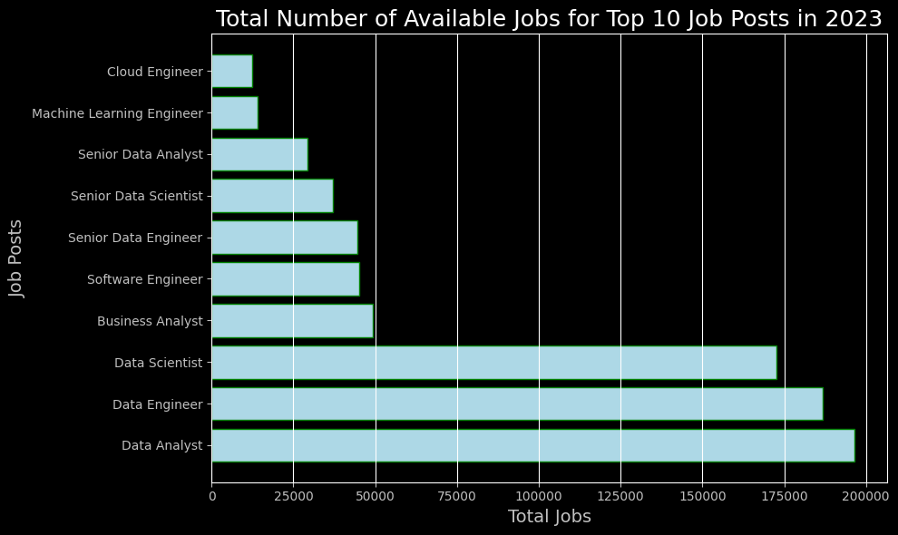

# Introduction
📊Dive into data job market! Focusing on data analyst and adata scientist roles, this project explores 🌏 top-paying jobs, in demand skills and where high demand meets high salary in data analytics 📈

# Backgroud
Driven by a quest to navigate the data job market more effectively, this project was born from a desire to pinpoint top-paid and in-demand skills, streamlining other work to find optimal jobs.

Data hails from [Data Files](https://drive.google.com/drive/u/0/folders/1kX3CkHR-gusbZEKLymiZJddtDSWrhkPQ). It's packed with insights on job titles, salaries, locations, and essential skills for the year 2023.

### The questions I wanted to answer through my SQL queries are:

1. What are the top-paying data analyst jobs?
2. What skills are required for these top-paying jobs?
3. What skills are most in demand for Data Scientists (or any other roles) ?
4. Which skills are associated with higher salaries ?
5. What are the most optimal skills to learn ?

# Tools I Used
For my deep dive into the job market, I harnessed the power of several key tools:

- **SQL:** The backbone of my analysis, allowing me to query the databse and unearth critical insights.
- **PostgreSQL:** The chosen database management system, ideal for handling the job postings data.
- **Visual Studio Code:** My go-to for database management and executing SQL queries.
- **Git & GitHub:** Essential for version control and sharing my SQL scripts and analysis, ensuring collaboration and project tracking.

# The Analysis
Each query for this project aimed at investigating specific aspects of the job market.  
All of the following graphs/charts and tables are generated using google collab after saving query outputs as .csv file.  
Here are some of the analysis obtained:

## Total Number of Jobs Available
The first example of analysis focuses on the jobs posted over the whole year of 2023.

The insights came out as:  
Data Analyst had the highest number of job postings, around 196K openings throughout 2023 followed by Data Engineer and Data Scientist as 186K and 172K openings, respectively with short difference margins.

*Bar graph visualing the total jobs for all posts.*

## 1. Top Paying Data Analyst Jobs
For the first query to identify the highest-paying roles, I filtered data analyst positions by average yearly salary and location, focusing on any locations. This query highlights the high paying oppurtunities in the field.

### Here's the breakdown:
- **Wide Salary Range:** Top 10 paying data analyst roles span from $184,000 to $650,000 highlighting exceptional potential in the field.
- **Diverse Employers:** Companies like Meta and AT&T are among those offering high salaries.
- **Job Variety:** High diversity in job titles, reflecting varied roles within data analytics.

## 2. Skills for Top Paying Jobs
To understand what skills are required for the top-paying jobs, I joined the job postings with skills data, providing insights into what employers value for high-compensation roles.

### Analysis:
- **SQL and Python:** both are top required skills with a bold count of 13.
- **Tableau:** Follows closely with a count of 10.
- **R programming** at the 4th place and other skills like **Azure, Excel,** and **AWS** show varying degrees of demand.

## 3. In-Demand Skills for Data Scientists
This query helped identify the skills most frequently requested in job postings, directing focus to areas with high demand.

|   Skills   |	Demand-Count  |
|---------|-------------------|
| Python |	114016              |
|Sql         |	79174               |
|R            |	 59754               |
|SAS         |	29642               |
|Tableau  |	 29513               |

*Table showing top 5 most demanded skills in data scientist postings*

### Breakdown:
- **Python, SQL** and **R** remain fundamental, showing strong foundational skills in programming/coding to perform data manipulation and data processing.
- **Vizualization** Tools such as SAS and Tableau are important for the data storytelling and decision support.

## 4.Skills Based on Salary for Data Analysts
Exploring the average salaries associated with different skills revealed which skills are highest paying.

|       Skills      |       Average Salary($)       |
|---------------|----------------------------|
|  pyspark       |           208172                  |
|bitbucket       |   189155                          |
|couchbase     |160515                             |
|watson           |160515                             |
|datarobot      |155486                             |
|gitlab             |154500                             |
|swift              |153750                             |
|jupyter           |152777                             |
|pandas         |151821                               |

*Table revealing Top 10 skills required for highest salary jobs*

### Keypoints:
All the above skills are Integral part of high paying data analyst jobs used in a variety of domains.
- Big Data and Data Engineering = Pyspark and Couchbase
- Version Control and DevOps = Bitbucket and GitLab
- Machine Learning and Artificial Intelligence (AI) = Watson(IBM Watson), DataRobot, Pandas, Jupyter.
- Development Tools (macOS, iOS) = Swift
- Data Science and Data Analysis = Pandas and Jupyter

## 5.Most Optimal Skills to Learn for Data Scientist
Combining results from Query3 demand and Query4 salary data, this query pinpoints skills that are both high demand and offer high salaries, offering strategic focus for skills development.

*Scatter plot of optimal skills for Data Scientist*

| skill_id | skills            | demand_count | avg_salary |
|----------|-------------------|--------------|------------|
| 237      | asana             | 98           | 215477     |
| 232      | airtable          | 65           | 201143     |
| 173      | redhat            | 84           | 189500     |
| 85       | watson            | 360          | 187417     |
| 41       | elixir            | 49           | 170824     |
| 50       | lua               | 36           | 170500     |
| 247      | slack             | 405          | 168219     |
| 38       | solidity          | 125          | 166980     |
| 153      | ruby on rails     | 47           | 166500     |
| 111      | rshiny            | 454          | 166436     |

*Tabular form of Top 10 most optimal skills for Data Scientists*

### Insights
- Project Management & Collaboration = Asana, Airtable, Slack
- Data Science & Analytics = RShiny, Watson
- Cloud Computing & DevOps = Red Hat
- Programming Languages = Elixir, Lua, Ruby on Rails
- Blockchain & Smart Contracts = Solidity

# Conclusions
This SQL project provided valuable insights into the landscape of job opportunities, salary distributions, and essential skills within the industry. By leveraging SQL to analyze the dataset, we were able to identify trends in demand for various skills, revealing which competencies are most sought after by employers. Additionally, the analysis of salary data highlighted disparities across different roles and skill sets, offering a clearer picture of potential earning trajectories in the job market. These findings not only underscore the importance of specific technical skills but also serve as a guide for job seekers and professionals looking to enhance their careers in an ever-evolving workforce. Overall, this project demonstrates the power of data analysis in informing strategic career decisions and fostering a deeper understanding of the job market dynamics.